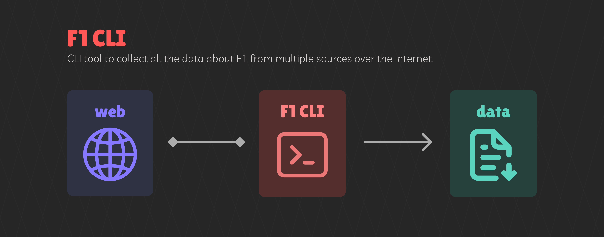

# Formula 1 CLI

CLI tool for collecting Formula 1 data.

# Description

This project was created because I needed data for my [formula1-server](https://github.com/simecek-m/formula1-server) application so I decided to try building a CLI tool with a built-in web scraper and third-party service calls via REST API to make collecting the data easier.

# Screenshots

Screenshots showing application running in the terminal.

# Sources

## Formula 1 official page

Web scraper for Formula 1 [web page](https://www.formula1.com/). Collecting historical and current data about:

- seasons
- drivers
- teams
- races
- circuits

## REST Countries

[REST API](https://restcountries.com/) for collect informations about Countries:

- name
- code (International Olympic Committee country codes - IOC )
- flag

# Output

Output data are stored as separated CSV formatted files in data folder.

    data
      |- drivers.csv
      |- teams.csv
      |- races.csv
